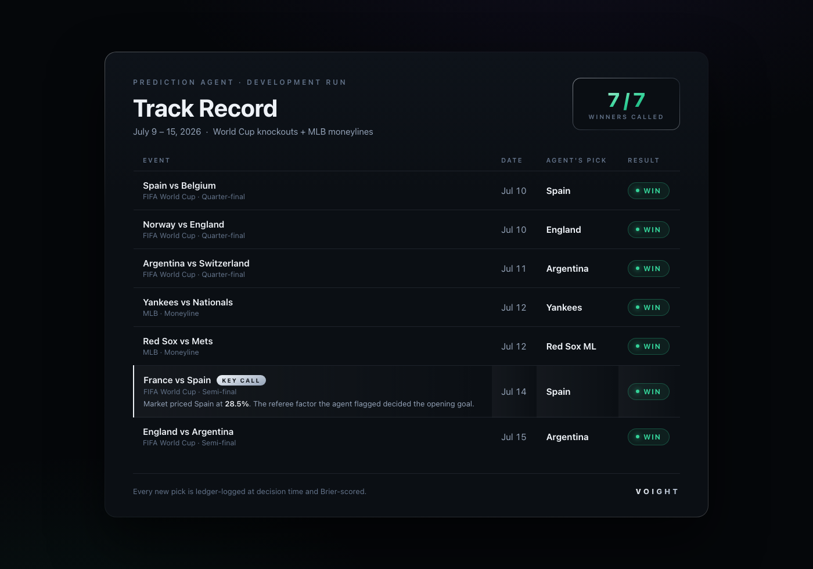

# Sharp Movement Detector on Voight

**TxLINE World Cup Hackathon 2026 submission.**

An autonomous [Voight](https://agent.voight.xyz) agent that watches TxLINE's
Solana-anchored World Cup odds in real time, detects sharp market movements
with a fully deterministic algorithm, explains them with live research, and
alerts its owner over Telegram, with every pick logged to an auditable
calibration ledger.

> We didn't build a bot for this hackathon. We plugged TxLINE into a platform
> where anyone can deploy an agent like this one in two minutes.

  

---

## Contents

1. [How it works](#how-it-works)
2. [Verify it yourself](#verify-it-yourself-2-minutes-no-keys-needed)
3. [The detector](#the-detector)
4. [Data and methodology](#data-and-methodology)
5. [Track record](#track-record)
6. [Live deployment](#live-deployment)
7. [Repository layout](#repository-layout)
8. [Roadmap](#roadmap)

---

## How it works

```
TxLINE (Solana mainnet)                       Voight platform (production)
┌──────────────────────┐                     ┌──────────────────────────────────┐
│ on-chain subscription │  API token          │ per-agent container (Cloud Run,  │
│ (program 9ExbZ…KaA,   ├────────────────────▶│ private, scale-to-zero)          │
│ level 12, real-time)  │                     │  ├─ hermes runtime + LLM         │
└──────────────────────┘                     │  ├─ skill: txline                 │
┌──────────────────────┐   REST + SSE        │  │   ├─ txline_client.py (auth)  │
│ /api/fixtures|odds|   ├────────────────────▶│  │   └─ sharp_detect.py         │
│ scores + /stream      │                     │  └─ skill: sports-odds (ledger)  │
└──────────────────────┘                     └───────────────┬──────────────────┘
                                              scheduled task │ alerts
                                                             ▼
                                                Telegram + market card
```

The division of labor is the core design decision, learned the hard way in
production: **the LLM never does market math**. A deterministic script detects;
the agent narrates, investigates the cause with live web research, and delivers
the alert. Detection you can audit, explanation you can read.

1. A **scheduled task** wakes the agent and scans every active fixture.
2. `sharp_detect.py` builds implied-probability series from TxLINE's demargined
   `Pct[]` feed and applies the calibrated thresholds below.
3. On alert, the agent researches the likely cause (goal, red card, lineup
   news), sends a Telegram message with a market card, and logs any pick it
   takes into its persistent ledger.
4. No alert, no noise: a silent market produces a single short line.

## Verify it yourself (2 minutes, no keys needed)

The calibration backtest runs locally on the real semifinal capture with the
Python standard library only (3.10+):

```bash
git clone https://github.com/Voightxyz/voight-txline-agent
cd voight-txline-agent
python3 detector/sharp_detect.py replay captures/odds-stream-semifinal-20260715.jsonl
python3 detector/sharp_detect.py params
```

Expected output: 1,773 events scanned, 32 series built, **exactly 2 alerts**
(both legitimate; see [Data and methodology](#data-and-methodology)).

To run against live TxLINE data, mint your own API token with the free World
Cup tier (one on-chain transaction; see
[TxLINE's quickstart](https://txline.txodds.com/documentation/quickstart)) and:

```bash
export TXLINE_API_TOKEN=<your token>
python3 detector/txline_client.py fixtures
python3 detector/sharp_detect.py scan <fixtureId>
```

Our on-chain subscription: [`21jNAk2y…C5su4`](https://solscan.io/tx/21jNAk2yYp7u7Ua1wTSRNMh9Mhw239cjAdLLkth4YHSr9pKpwsdr5aN8Whmhynnk2FcFufwcBbMsE6pMx8rC5su4)
(Service Level 12, real-time, paid by the same wallet that registers our
agents on-chain in the Metaplex MPL Agent Registry).

## The detector

For every market series (fixture × market type × outcome), using TxLINE's
demargined `Pct[]` implied probabilities (percentage points, 3 decimals):

```
alert  ⇔  |ΔPct| over 120 s ≥ 5 pts   AND   |ΔPct| ≥ 3σ of the series' own recent noise
          (then a 5-minute per-series debounce)
```

Two conditions on purpose: the absolute floor keeps thin markets from alerting
on noise, and the z-score test keeps calm markets honest about what "abnormal"
means for them specifically. Full math, watched market types and parameter
table in [docs/TECHNICAL.md](docs/TECHNICAL.md).

## Data and methodology

**We record real market data and test against it.** During the England vs
Argentina semifinal (July 15, fixture 18241006) we recorded TxLINE's live SSE
odds stream as the match played. That capture ships in this repo
(`captures/`, 755 KB, 1,773 events) so the calibration result is reproducible
by anyone, not claimed by us:

- The detector fired **exactly 2 alerts** on the whole capture: the violent
  repricing of `under/over 3.5 goals` (±10.7 pts, z ≈ 18) as regulation ended
  1-1. Zero false positives through normal drift.
- **Every new pick the deployed agent takes is ledger-logged at decision time**
  (timestamp + stated probability) and Brier-scored once the event settles.
  The track record is an artifact you can inspect, not a screenshot.

## Track record

**Development run (July 9-15, 2026): 7 for 7.** During development, our
prediction agent called seven consecutive winners across World Cup knockouts
and MLB moneylines, including **Spain over France against a 28.5% market
price** (the referee factor it flagged decided the opening goal).



## Live deployment

The detector runs inside a production Voight agent (Google Cloud Run, private,
scale-to-zero) with an hourly scheduled task scanning active fixtures. Alerts
arrive on Telegram with a market card. Agent identity is registered on-chain
(Metaplex MPL Agent Registry, Solana mainnet).

Anyone can deploy an equivalent agent at [agent.voight.xyz](https://agent.voight.xyz)
in about two minutes; the txline skill ships in the platform image.

## Repository layout

| Path | What it is |
|---|---|
| `detector/sharp_detect.py` | The deterministic Sharp Movement Detector. No LLM in the loop. |
| `detector/txline_client.py` | Minimal TxLINE API client (guest-JWT auto-renewal + API token auth). |
| `captures/` | The full real SSE capture from the semifinal used for calibration. |
| `docs/TECHNICAL.md` | Architecture, exact TxLINE endpoints used, detection math, ops notes. |
| `docs/API-FEEDBACK.md` | Honest feedback on the TxLINE API from building this. |
| `docs/SKILL.md` | The hermes skill file the deployed agent loads. |

## Roadmap

- Per-minute scan cadence during live match windows (scheduler presets today
  are hourly).
- More competitions via paid TxLINE bundles (TxL token subscriptions).
- Pointing the same detector at other probability feeds (Polymarket) so alerts
  cover prediction markets beyond sports.

## Team

Built by [Voight](https://voight.xyz): autonomous agents, deployed in minutes.

Licensed under the [MIT License](LICENSE).
